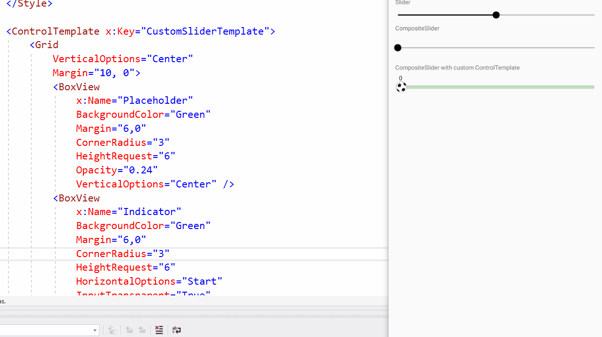

# Xamarin.Forms Composite Controls

In this repository there are only some tests related to the idea of composite controls and above all have a **Template** property and be able to use **ControlTemplate** to customize a control.

## Let's see more details!

For these tests we have created a Slider Composite control (composed of other Views that make up the control).


We have the same visual appearance, properties and events. However, the control has a Template property that allows us to modify the ControlTemplate that defines the control.

We modify the Slider ControlTemplate:

```
<ControlTemplate x:Key="CustomSliderTemplate">
    <Grid 
        VerticalOptions="Center"
        Margin="10, 0">
        <BoxView 
            x:Name="MaximumTrack"
            BackgroundColor="Green"
            Margin="6,0"
            CornerRadius="6"
            HeightRequest="6"
            Opacity="0.24"
            VerticalOptions="Center" />
        <BoxView 
            x:Name="MinimumTrack"
            BackgroundColor="Green"
            Margin="6,0"
            CornerRadius="6"
            HeightRequest="6"
            HorizontalOptions="Start"
            InputTransparent="True"
            VerticalOptions="Center"
            WidthRequest="0" />
        <Image        
            x:Name="Thumb" 
            Margin="0"
            BackgroundColor="Transparent"
            Source="football.png"
            HeightRequest="36"
            HorizontalOptions="Start"
            VerticalOptions="Center"
            WidthRequest="36" />
    </Grid>
</ControlTemplate>
```

And we use it:

```
<Slider 
    Template="{StaticResource CustomSliderTemplate}"/>
```

The result:


We can use XAML Hot Reload to adjust the appearance:



Some **performance** related data (using Android):

Memory
* 127545344 (121MB) - Slider
* 127246336 (121MB) - Slider (Composite)

Startup time (Release AOT)
* 797ms - Slider
* 801ms - Slider (Composite)